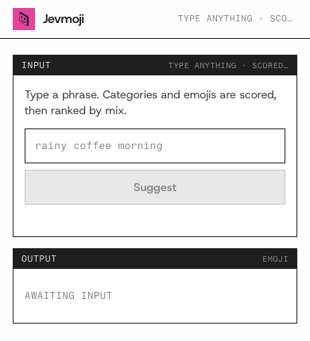
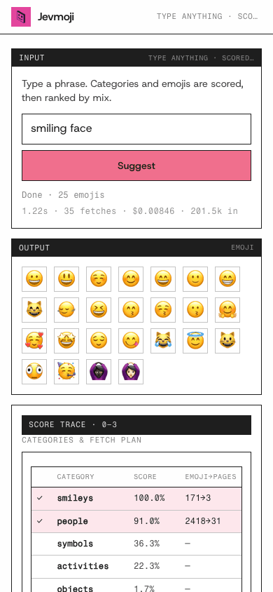

<div align="center">
	<br>
	
	<br>
	<br>
</div>

# Jevmoji

> Type up to 40 characters. Get related emojis scored by [TypeSafe](https://typesafe.ai/)’s [Jev](https://typesafe.ai/blog/introducing-system-one-models-and-jev) — many matches, not just one.





## Install

```sh
npm install
echo 'TYPESAFE_API_KEY=your-key' > .dev.vars
```

Get a key from the [TypeSafe console](https://console.typesafe.ai/).

## Usage

```sh
npm run dev
```

http://127.0.0.1:8787

| Command | Description |
| --- | --- |
| `npm run dev` | Vite + Worker with HMR |
| `npm test` | Unit tests (`node --test`) |
| `npm run build` | Production build to `dist/` |
| `npm run deploy` | `vite build` + `wrangler deploy` |
| `npm run catalog` | Rebuild `src/data/emojis.json` from Unicode |

## Secrets

The TypeSafe key never reaches the browser. The Worker reads it server-side.

| Where | How |
| --- | --- |
| Local | `.dev.vars` — `TYPESAFE_API_KEY=…` |
| Production | `npx wrangler secret put TYPESAFE_API_KEY` |

Never put the key in `.env`, client JS, or the README.

## Environment

### TYPESAFE_API_KEY

Type: `string`

Required. Server only.

### TYPESAFE_MODEL

Type: `string`\
Default: `'jev-latest'`

### TYPESAFE_TIMEOUT_MS

Type: `number`\
Default: `60000`

SDK timeout per attempt.

### TYPESAFE_PRICE_PER_MTOK

Type: `number`\
Default: `0.042`

Cost display only.

### EMOJI_PAGE_SIZE

Type: `number`\
Default: `80`

## Emoji catalog

`src/data/emojis.json` is generated — not hand-edited. It is Worker-only (imported at build time); nothing in the browser fetches it, so it does not live under `public/`.

```sh
npm run catalog                          # Unicode 17.0.0 (default pin)
npm run catalog -- --unicode 16.0
npm run catalog -- --unicode latest      # currently 18.0
npm run catalog -- --include-qualified   # also minimally-qualified + components
```

Default is **17.0.0**: newer than 16, less brand-new than 18 (fonts often lag). Older versions (≤16) live under `unicode.org/Public/emoji/<ver>/`; 17+ live under `unicode.org/Public/<ver>/emoji/`. The script resolves that split for you.

The Worker only needs glyph, name, category, and qualification status — so the generator drops keywords, hex, subgroup, and ids to keep the Worker bundle smaller.

## Project structure

| Path | Description |
| --- | --- |
| `index.html` + `js/` | Page + client ranking |
| `public/` | Client static assets (styles, favicon) — no catalog |
| `src/worker.js` + `src/data/` | Worker + generated emoji catalog |
| `scripts/build-emojis.mjs` | Catalog generator |
| `design/` | Logo source + export sizes |
| `docs/screenshots/` | README screenshots |
| `AGENTS.md` | Contributor / agent notes (includes private API contract) |
| `DESIGN.md` | Visual system |

## Related

- [TypeSafe AI](https://typesafe.ai/) - System One models
- [Jev](https://typesafe.ai/blog/introducing-system-one-models-and-jev) - Intro post
- [Documentation](https://docs.typesafe.ai/)
- [@typesafe-ai/sdk](https://www.npmjs.com/package/@typesafe-ai/sdk) - JavaScript SDK

## License

MIT. See [LICENSE](LICENSE).

TypeSafe and Jev are proprietary — not covered by this license.
